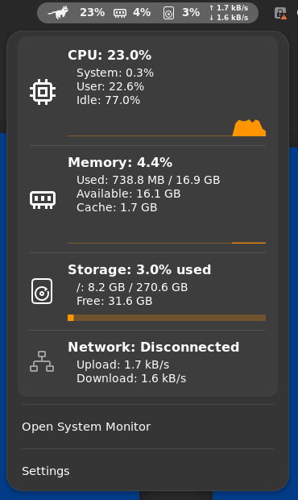

# RunCat for GNOME Shell

**RunCat** provides a key-frame animation to the GNOME Shell top bar. \
Animation speed changes depending on CPU usage.

<br />


## System metrics (fork)

This fork extends RunCat with a [RunCat Neo](https://github.com/runcat-dev/RunCatNeo)-like
dashboard. Click the cat to see a card per metric:

- **CPU** — total, system, user and idle time, temperature and a usage chart
- **Memory** — used, available, cache, swap and a usage chart
- **Storage** — used/total space and a usage bar (any mount point, `/` by default)
- **Battery** — level, power source, status, time remaining, power draw, health and cycle count
- **Network** — connection type, local IP, upload and download speed

CPU temperature, memory, storage, battery level and network speed can also be
shown next to the cat in the top bar. When the cards don't fit the screen height, the menu grows
sideways into columns. Everything is configurable on the
**Metrics** page of the preferences.



Data comes straight from the kernel (`/proc`, `/sys`) and NetworkManager, no extra
packages are needed.

### Custom metrics

Scripts, cron jobs and hooks can add their own cards by writing a small JSON file to
`~/.config/runcat/metrics/` (the same format as RunCat Neo's custom metrics). Ready-made
samples: **Claude Code usage** (5-hour/7-day limits, context, cost), **Claude Code sessions**
through hooks (working / waiting for you / done) and **GPU** (NVIDIA and AMD).
See [docs/custom-metrics.md](docs/custom-metrics.md).

## Philosophy

The upstream **RunCat is intentionally minimalistic** — a running cat in the top bar and a
CPU percentage next to it. This fork trades part of that minimalism for the metrics above,
which is why these changes live here and not upstream.

Before opening a pull request, please read [CONTRIBUTING.md](CONTRIBUTING.md).

## Installation

This fork uses its own UUID (`runcat@victorandreon`) and settings, so it never conflicts
with the RunCat published on extensions.gnome.org.

You need `npm` installed. Clone this repository and run:

```bash
$ npm i # one time only
$ make install
```

Then log out and log in, and enable it (GNOME Extensions → RunCat → On, or
`gnome-extensions enable runcat@victorandreon`).

If the original RunCat is installed, remove it to avoid two cats in the top bar:
`gnome-extensions uninstall runcat@kolesnikov.se`.

### Manage RunCat preferences
- Right-click on the extension button on the top bar → Settings;
- or Open GNOME Extensions → RunCat → ⚙️;
- or Manage directly in `dconf`: `dconf list /org/gnome/shell/extensions/runcat-victorandreon/`.

## Translations

### Working with existing translations

`make translations` command extracts translatable strings and updates existing translations.
Make sure that you've run this command before pushing changes.

- `make po/messages.pot` command extracts translatable strings;
- `make po/*.po` command updates existing translations.

### Starting new translation

To create a new translation file, use the following command: \
`msginit -i po/messages.pot -l <locale> --no-translator -o po/<locale>.po`.

Please be prepared to maintain your translation in future versions of the
extension (see [CONTRIBUTING.md](CONTRIBUTING.md)).

#### Examples
**Spanish** locale: `msginit -i po/messages.pot -l es --no-translator -o po/es.po`. \
**Spanish (Argentina)** locale: `msginit -i po/messages.pot -l es_AR --no-translator -o po/es_AR.po`.

### Useful commands for developers

You need to install project JS dependencies first: `npm i`

- `npm run test` — run all available tests;
- `npm run test:typecheck` — check types;
- `npm run test:lint` — lint project files;
- `make spawn-gnome-shell` — spawn a nested GNOME Shell session to test the
  extension interactively (GNOME 49+); requires the `mutter-devkit` system
  package to be installed.

## macOS version
Thanks to [Takuto Nakamura](https://github.com/Kyome22/menubar_runcat) for [the macOS version](https://kyome.io/runcat/index.html) and cat images.

---
_Developed by [Sergei Kolesnikov](https://github.com/win0err)_
